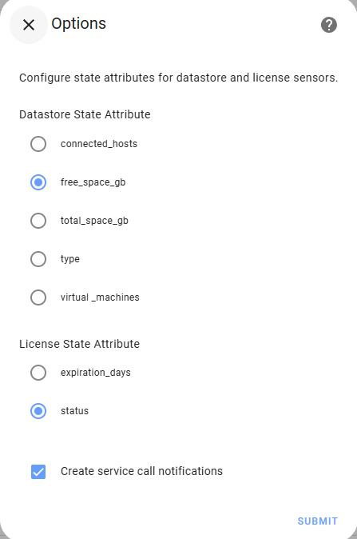
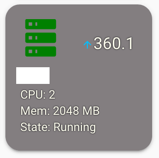

# ESXi Stats

[](https://github.com/hacs/integration)

Home Assistant integration for monitoring and controlling ESXi hosts and vCenter environments. Provides comprehensive VM and host management with individual devices for clean organization.

**Key Features:**
- ✅ Full vCenter multi-host support
- ✅ VM/Host power control with smart safety logic
- ✅ VM snapshot management
- ✅ Host power policy control
- ✅ Individual devices for better organization
- ✅ Real-time monitoring with proper units
- ✅ Automatic cleanup of stale VM/host entities and devices

## What's Monitored

**Per ESXi Host:** Version, uptime, CPU/memory usage, power policy, maintenance mode, VM count
**Per Virtual Machine:** Power state, CPU/memory usage, guest OS, IP address, VMware Tools status, snapshots
**Per Datastore:** Type, free/total space, connected hosts, VM count
**License Information:** Status, expiration, product type (requires admin permissions)

**Device Organization:**
Creates individual devices per ESXi host and VM. Datastore and license info grouped in main ESXi Stats device.

## Installation

### HACS (Recommended)
[](https://my.home-assistant.io/redirect/hacs_repository/?owner=wxt9861&repository=esxi_stats&category=integration)

1. Open HACS > Settings
2. Add custom repository: `https://github.com/wxt9861/esxi_stats` (Integration)
3. Install ESXi Stats
4. Restart Home Assistant
5. Go to Configuration > Integrations > Add Integration > ESXi Stats

### Manual Installation
1. Copy `custom_components/esxi_stats/` to your Home Assistant `custom_components/` directory
2. Restart Home Assistant
3. Add integration via UI

## Configuration

During setup, select which data types to monitor:

| Option | Data Collected | Permission Level |
|--------|----------------|------------------|
| **Hosts** | CPU/memory usage, uptime, power policy | Read-Only |
| **Datastores** | Free/total space, type, VM count | Read-Only |
| **VMs** | Power state, usage, guest OS, snapshots | Read-Only |
| **Licenses** | Status, expiration dates | Administrator |

**Configuration Options:**

| Parameter | Required | Default | Description |
|-----------|----------|---------|-------------|
| `host` | Yes | - | ESXi host or vCenter IP/hostname |
| `username` | Yes | - | Username for authentication |
| `password` | Yes | - | Password for authentication |
| `verify_ssl` | No | `false` | SSL certificate verification (use `false` for self-signed certs) |

> **💡 Tip**: Uncheck "Licenses" if you only need monitoring permissions

## Stale Entity Cleanup

Automatically removes VM and host entities and devices from Home Assistant when they no longer exist on the ESXi server.

**Configuration Options:**
1. Go to Configuration > Integrations > ESXi Stats > Configure
2. Enable "Automatically remove stale VM and host entities"

**Manual Cleanup Service:**
```yaml
service: esxi_stats.cleanup_stale_entities
data:
  host: "192.168.1.100"  # Your ESXi IP
```

> **🛡️ Safety**: Auto-cleanup is disabled by default. Only removes entities and devices for VMs/hosts that no longer exist on ESXi.

## Permissions Setup

### Quick Setup Options

**Option 1: Administrator Role (Easiest)**
- Full access to all features
- Works for both vCenter and standalone ESXi
- Assign built-in **Administrator** role to your service account

**Option 2: Read-Only + VM Power User (Balanced)**
- Good for VM management with host monitoring
- Use **VM Power User** role for vCenter
- Use **Administrator** for standalone ESXi (no VM Power User equivalent)

**Option 3: Read-Only Only (Monitoring)**
- Safe monitoring-only access
- Use built-in **Read-Only** role
- Cannot control power or access license info

### Custom Role Permissions

If you prefer minimal permissions, create a custom role with these exact privileges as they appear in the UI:

#### vCenter Permissions

**For Monitoring Only:**
```
Datastore > Browse
Global > Licenses
```

**Add for VM Power Control:**
```
Virtual Machine > Interact > Power On
Virtual Machine > Interact > Power Off
Virtual Machine > Interact > Reset
Virtual Machine > Interact > Suspend
```

**Add for Host Power Control:**
```
Host > Config > Power
```

**Add for VM Snapshots:**
```
Virtual Machine > State > Create Snapshot
Virtual Machine > State > Remove Snapshot
```

**Full Control (All Features):**
```
Datastore > Browse datastore
Global > Licenses
Host > Configuration > Power
Virtual machine > Interaction > Power On
Virtual machine > Interaction > Power Off
Virtual machine > Interaction > Reset
Virtual machine > Interaction > Suspend
Virtual machine > Snapshot management > Create snapshot
Virtual machine > Snapshot management > Remove snapshot
```

#### ESXi Standalone Permissions

**For Monitoring Only:**
```
System > View
System > Read
Datastore > Browse datastore
Global > Licenses
```

**Add for VM Power Control:**
```
VirtualMachine > Interact > PowerOn
VirtualMachine > Interact > PowerOff
VirtualMachine > Interact > Reset
VirtualMachine > Interact > Suspend
```

**Add for Host Power Control:**
```
Host > Config > Power
```

**Add for VM Snapshots:**
```
VirtualMachine > State > CreateSnapshot
VirtualMachine > State > RemoveSnapshot
```

**Full Control (All Features):**
```
System > View
System > Read
Datastore > Browse datastore
Global > Licenses
Host > Config > Power management
Virtual machine > Interaction > Power On
Virtual machine > Interaction > Power Off
Virtual machine > Interaction > Reset
Virtual machine > Interaction > Suspend
Virtual machine > Snapshot management > Create snapshot
Virtual machine > Snapshot management > Remove snapshot
```

### Setup Steps

**vCenter:**
1. Create service account in your identity source
2. Add user to vCenter: Administration > SSO > Users and Groups
3. Assign role: Administration > Access Control > Global Permissions
4. Test login with service account

**Standalone ESXi:**
1. Create local user: Host > Manage > Security & Users > Users
2. Assign role to user
3. Test login with service account

### Quick Reference

| Feature | vCenter Permissions | ESXi Standalone |
|---------|-------------------|-----------------|
| **Monitor hosts/VMs/datastores** | Datastore > Browse datastore | Read-Only role |
| **View license information** | Global > Licenses | Administrator role |
| **Control VM power** | Virtual Machine > Interact > Power* permissions | Administrator role |
| **Control host power** | Host > Config > Power | Administrator role |
| **Change power policies** | Host > Config > Power | Administrator role |
| **Manage snapshots** | Virtual Machine > State > *Snapshot permissions | Administrator role |

## Sensor States

Customize what datastore and license sensors display as their state:
1. Go to Configuration > Integrations > ESXi Stats > Options (gear icon)
2. Enter the attribute name you want as the sensor state
3. Restart Home Assistant



## UI Controls

**VM Management:**
- **Power switches** - Smart shutdown (graceful when VMware Tools available, hard power off otherwise)
- **Reboot buttons** - Smart reboot (graceful when VMware Tools available, hard reset otherwise)
- **Snapshot buttons** - Create timestamped snapshots, remove all/first/last snapshots

**Host Management:**
- **Power switches** - Graceful host shutdown
- **Reboot buttons** - Safe host restart
- **Power policy selectors** - Change power management policy (static, dynamic, low, custom)

All controls include safety features and automatic status updates.

## Service Calls

Requires full ESXi license. Available services:

**Host Management:**
- `esxi_stats.host_power` - shutdown/reboot hosts
- `esxi_stats.host_power_policy` - change power policy
- `esxi_stats.list_hosts` - list vCenter hosts
- `esxi_stats.list_power_policies` - list available policies

**VM Management:**
- `esxi_stats.vm_power` - control VM power state
- `esxi_stats.create_snapshot` - create VM snapshot
- `esxi_stats.remove_snapshot` - remove VM snapshots

**Entity Management:**
- `esxi_stats.cleanup_stale_entities` - remove stale VM/host entities and devices

Example:
```json
{
  "host": "vcenter.domain.com",
  "target_host": "esxi01.domain.com",
  "command": "shutdown"
}
```

## Presenting Data in Home Assistant

Several dashboard options work well with the individual sensor structure:

- Use [Custom flex-table-card](https://github.com/custom-cards/flex-table-card)
  - Example lovelace yaml can be found [here](examples/flex-table-card-example.yaml)
  - 
- Use [Custom flex-horseshoe-card](https://github.com/AmoebeLabs/flex-horseshoe-card) paired with [Custom decluttering-card](https://github.com/custom-cards/decluttering-card)
  - Example lovelace yaml can be found [here](examples/flex-horseshoe-card/ui-lovelace.yaml)
  - This example is valid for flex-horseshoe-card 0.8.2 and declutering-card 0.2.0
  - 
- Use [Custom button-card](https://github.com/custom-cards/button-card)
  - Example lovelace yaml can be found [here](examples/button-card-example.yaml)
  -  
  - 

## Troubleshooting

**Connection Issues:**
- Verify credentials and network connectivity
- Check SSL verification setting (use `false` for self-signed certs)
- Ensure vCenter/ESXi API is accessible on port 443

**Missing Features:**
- Service calls require full ESXi license
- UI controls need appropriate permissions (see Permissions Setup)
- Check Home Assistant logs for permission errors

**Debug Logging:**
```yaml
logger:
  logs:
    custom_components.esxi_stats: debug
```

**Support:** [GitHub Issues](https://github.com/wxt9861/esxi_stats/issues)
